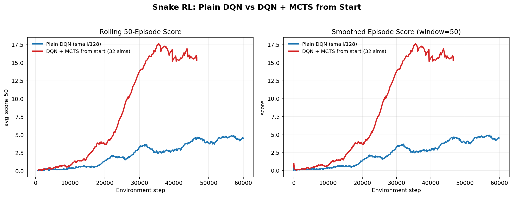
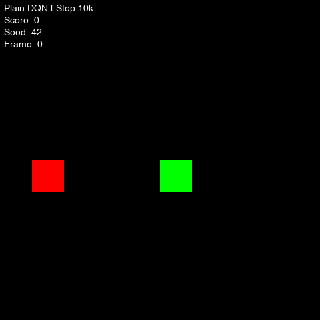
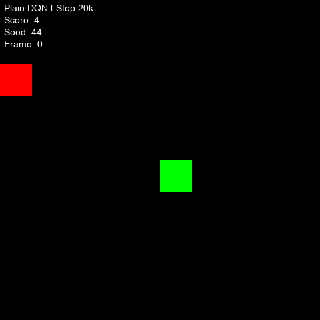
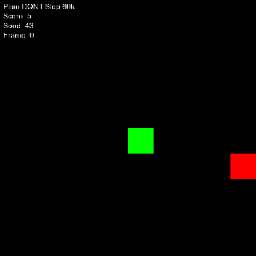

# Snake RL from Pixels

This repository trains Snake agents directly from rendered board images and compares three control setups:

- plain DQN
- DQN with configurable MCTS rollouts
- GRPO

The current strongest baseline in this repo is the original `small` DQN encoder with `hidden_dim=128`. The recent work in this branch adds:

- a working GRPO implementation
- a configurable MCTS planner in [`snake_rl/algos/mcts.py`](snake_rl/algos/mcts.py)
- DQN training, evaluation, and video generation hooks that can run with or without search
- TensorBoard logging for early rolling averages such as `avg_score_running`, `avg_score_10`, `avg_score_25`, and `avg_score_50`

## Current DQN vs MCTS results

These numbers come from the runs currently checked in under `outputs/` and `logs/tensorboard/`.

| Experiment | Steps seen | Episodes | Mean score | Last 50 | Max score | Notes |
| --- | ---: | ---: | ---: | ---: | ---: | --- |
| Plain DQN (`small`, `hidden_dim=128`) | 60,000 | 1,358 | 1.46 | 4.54 | 14 | Raw engine reward |
| DQN + MCTS from start | 46,563 | 783 | 3.56 | 15.34 | 35 | `32` simulations per move |

This is the clean apples-to-apples comparison: plain DQN against DQN trained from scratch with search enabled at action selection time.



The plot above compares:

- `avg_score_50` over environment steps
- a smoothed episode-score trace over environment steps

The qualitative checkpoint GIFs below come from the strong plain DQN run at `5k`, `10k`, `20k`, `35k`, and `60k` steps.

### 5k steps


### 10k steps



### 20k steps



### 35k steps


### 60k steps



## Reward function used in the main runs

The comparison runs use the raw reward from [`snake_rl/sim/engine.py`](snake_rl/sim/engine.py):

- `+10.0` for eating food
- `-10.0` for hitting a wall or the snake body
- `-0.01` for a normal step

No extra shaping reward is applied in the main DQN vs MCTS comparison.

## Strong DQN architecture

The best plain DQN run in this repo uses the `small` encoder from [`snake_rl/algos/models/cnn_encoder.py`](snake_rl/algos/models/cnn_encoder.py):

- input: `42 x 42 x 3`
- conv: `3 -> 32`, `3x3`, stride `2`
- conv: `32 -> 64`, `3x3`, stride `2`
- conv: `64 -> 64`, `3x3`, stride `1`
- conv: `64 -> 64`, `3x3`, stride `1`
- flatten: `11 x 11 x 64 = 7744`
- FC: `7744 -> 128`
- Q head: `128 -> 4`

Parameter count:

- `1,085,124`

This is the same architecture used for the plain DQN baseline and the MCTS-augmented DQN runs shown above.

## MCTS configuration

The search policy is implemented in [`snake_rl/algos/mcts.py`](snake_rl/algos/mcts.py). The main comparison run uses:

```python
mcts_config = {
    "enabled": True,
    "num_simulations": 32,
    "max_depth": 8,
    "rollout_policy": "agent",
    "exploration_c": 1.4,
    "discount": 0.99,
    "action_selection": "visit",
    "respect_agent_exploration": True,
}
```

This lets you run:

- plain DQN
- DQN trained from scratch with search at action selection time

without changing the underlying model definition.

## Repository layout

```text
snake_rl/
  algos/
    dqn.py
    grpo.py
    mcts.py
    models/cnn_encoder.py
  env/
    snake_env.py
  sim/
    engine.py
    renderer.py
  tests/
train_and_visualize.py
train_dqn.py
evaluate.py
demo.py
```

## Setup

Python:

- `>=3.10,<3.13`

Install with Poetry:

```bash
poetry install
```

Or use the included setup helper:

```bash
./repo_init.sh
python3 setup_env.py
poetry install
```

## Running experiments

The training helpers live in [`train_and_visualize.py`](train_and_visualize.py).

Run the default training and asset-generation pipeline:

```bash
poetry run python train_and_visualize.py
```

Run the strong plain DQN baseline from a Python snippet:

```bash
poetry run python - <<'PY'
from pathlib import Path
from train_and_visualize import train_dqn, _detect_device

train_dqn(
    device=_detect_device(),
    save_dir=Path("outputs/dqn_small128_60k"),
    total_steps=60_000,
    hidden_dim=128,
    encoder_type="small",
)
PY
```

Run DQN with MCTS from scratch:

```bash
poetry run python - <<'PY'
from pathlib import Path
from train_and_visualize import train_dqn, _detect_device

mcts_config = {
    "enabled": True,
    "num_simulations": 32,
    "max_depth": 8,
    "rollout_policy": "agent",
    "exploration_c": 1.4,
    "discount": 0.99,
    "action_selection": "visit",
    "respect_agent_exploration": True,
}

train_dqn(
    device=_detect_device(),
    save_dir=Path("outputs/dqn_small128_mcts32"),
    total_steps=60_000,
    hidden_dim=128,
    encoder_type="small",
    mcts_config=mcts_config,
)
PY
```

## TensorBoard

Point TensorBoard at the log root:

```bash
poetry run tensorboard --logdir logs/tensorboard
```

Useful tags for DQN runs:

- `dqn/episode_score`
- `dqn/episode_reward`
- `dqn/q_value_mean`
- `dqn/avg_score_running`
- `dqn/avg_score_10`
- `dqn/avg_score_25`
- `dqn/avg_score_50`

## Tests

Run the tests with:

```bash
poetry run pytest
```

The GRPO-specific regression coverage lives in [`snake_rl/tests/test_grpo.py`](snake_rl/tests/test_grpo.py).

## Status

What is stable right now:

- plain DQN training
- MCTS-assisted DQN training and evaluation
- GRPO training loop and regression tests
- video generation from saved checkpoints

What still needs work:

- longer apples-to-apples MCTS-from-start runs all the way to 60k
- stronger README-quality visuals for the MCTS policy itself
- AlphaGo-style search experiments beyond the current planner baseline
